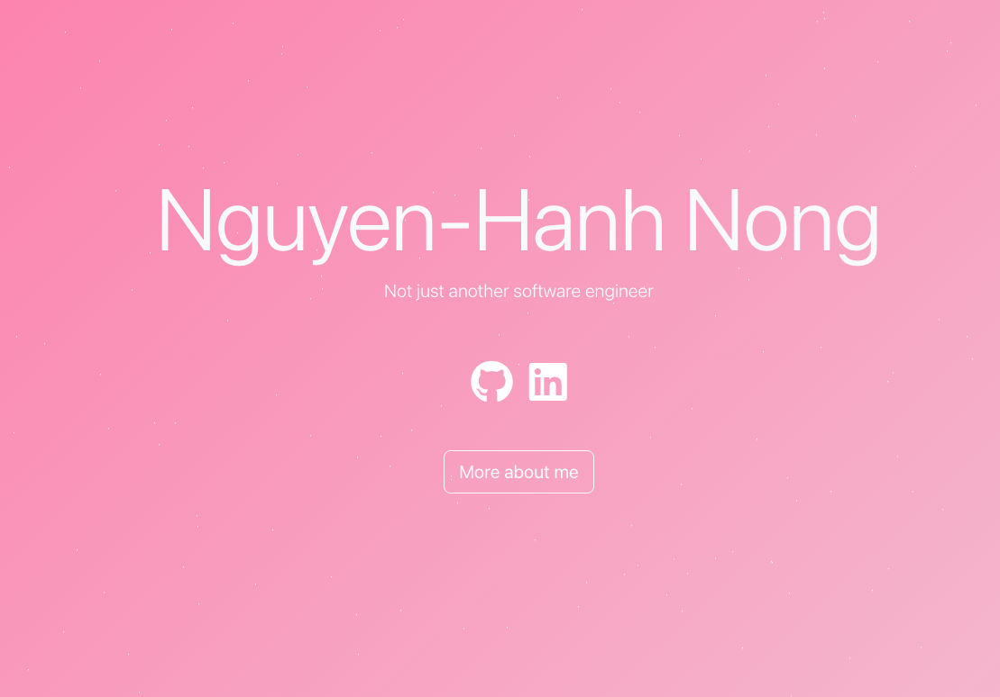

# Landing Page


[](https://github.com/Nguyen-HanhNong/star_book/network)
[](https://github.com/Nguyen-HanhNong/star_book/issues)
[](https://github.com/Nguyen-HanhNong/landing-page/blob/master/LICENSE)
[](https://nodejs.org)
[](https://nodejs.org)
## About The Project 



This project contains the code for my personal landing page, which can be found at [nnong.dev](https://nnong.dev). The landing page is built using React and styled with Bootstrap. To produce the dynamic social media posts on the page, the backend dynamically pulls the latest information from Instagram and GitHub using the Instagram API and the Github API.

## Getting Started

### Prerequisites

- The project requires Node.js and npm to run. If you do not have Node.js installed, you can download it [here](https://nodejs.org/en/download/).
- The project will also require git and a valid GitHub account to run. You can download git [here](https://git-scm.com/downloads).

### Instructions

1. Clone the repository
   ```sh
   git clone

2. Install NPM packages
   ```sh
    npm install

3. Run the project
   ```sh
   npm run start

4. Open the project in your browser
   ```sh
   http://localhost:3000/

## License

Distributed under the GNU General Public License v3.0. See `LICENSE` for more information.